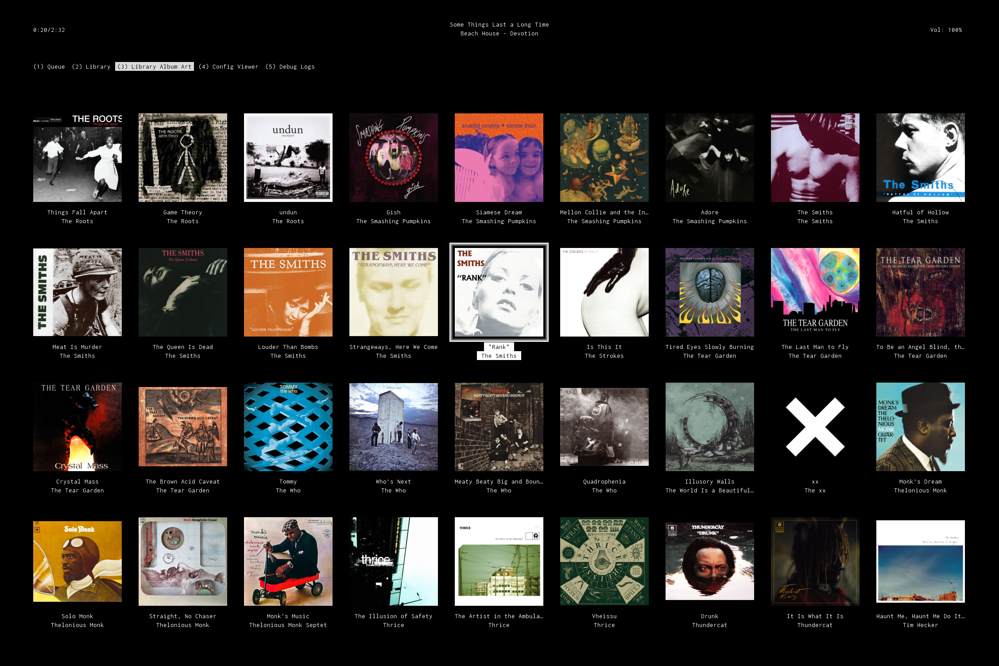
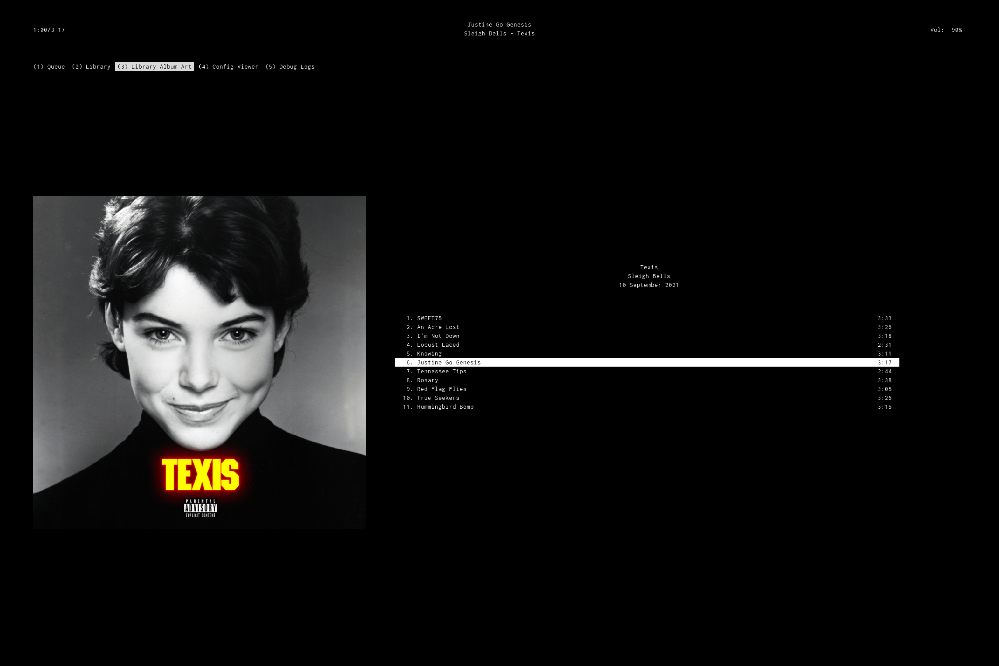

Based Black Music Player
========================

Minimal, responsive, aesthetically pleasing frontend for MPD. Written in Jai, inspired by `ncmpcpp`.

Configuration
-------------

If you have `$XDG_CONFIG_HOME` defined, then put your config in `$XDG_CONFIG_HOME/bbmp/bbmprc`.
Otherwise, put it in `$HOME/.bbmprc`.

Example config:

```
mpd_host = localhost
mpd_port = 6600
max_log_size = 1000
album_cover_directory = ~/.cache/bbmp/covers
mpd_library_directory = ~/media/music/library
log_level = normal
```

Make sure `mpd_library_directory` is set to the same folder that MPD loads your library from.

Album Cover Generation
----------------------

The `album_cover_directory` is the folder you want `bbmp` to save the generated album covers to. If `$XDG_CACHE_HOME`
is set, then they'll be saved to `$XDG_CACHE_HOME/bbmp/covers`, otherwise `~/.cache/bbmp/covers` is used. Right now,
you must create this directory manually, it will not be created for you.

For each album cover file in your library named `cover.jpg` or `cover.png`, two bitmap files will be generated and saved
to the `album_cover_directory`: an 800-pixel-width version of the cover, and a 200-pixel-width version. So, the
higher-resolution your original files are, the better these will look.

The 200 px covers are used as thumbnails in the Library Album Art view:



And the 800 px covers are used when viewing a specific album:



Keybindings
-----------

The entire program is navigable with keybindings only. There is currently no mouse support, but that may change in the
future. If you're familiar with `ncmpcpp`, then you'll already know many of the basics.

There are a few global keybindings, then each view has its own keybindings.

### Global

-   `1`: Go to the Queue
-   `2`: Go to the Library
-   `3`: Go to the Library Album Art
-   `4`: Go to the Config Viewer
-   `5`: Go to the Debug Logs
-   `p`: Toggle pause
-   `b`: Rewind
-   `f`: Fast forward
-   `<`: Previous song
-   `>`: Next song
-   `=`: Volume up
-   `-`: Volume down
-   `c`: Clear the queue
-   `Q`: Quit the program

### Queue View

-   `j`: Move the cursor down
-   `k`: Move the cursor up
-   `J`: Shift the selected song up in the queue
-   `K`: Shift the selected song down in the queue
-   `C-d`: Move the cursor half a page down
-   `C-u`: Move the cursor half a page up
-   `g`: Move the cursor to the top of the page
-   `G`: Move the cursor to the bottom of the page
-   `x`: Delete the selected song from the queue
-   `o`: Move the cursor to the currently playing song
-   `Enter`: Play the selected song
-   `/`: Start a search
    -   `Enter`/`Escape`: Submit the search
-   `n`: Move the cursor to the next search result
-   `N`: Move the cursor to the previous search result

### Library View

-   `j`: Move the cursor down
-   `k`: Move the cursor up
-   `j`: Move the cursor left
-   `l`: Move the cursor right
-   `C-d`: Move the cursor half a page down
-   `C-u`: Move the cursor half a page up
-   `g`: Move the cursor to the top of the current column
-   `G`: Move the cursor to the bottom of the current column
-   `o`: Move the cursor to the currently playing song
-   `Space`: Add the selected song to the queue
-   `Enter`: Add the selected song to the queue and play it
-   `/`: Start a search
    -   `Enter`/`Escape`: Submit the search
-   `n`: Move the cursor to the next search result in the current column
-   `N`: Move the cursor to the previous search result in the current column

### Library Album Art View

#### Library Subview

-   `j`: Move the cursor down
-   `k`: Move the cursor up
-   `j`: Move the cursor left
-   `l`: Move the cursor right
-   `C-d`: Move the cursor one page down
-   `C-u`: Move the cursor one page up
-   `g`: Move the cursor to the first album
-   `G`: Move the cursor to the last album
-   `o`: Move the cursor to the currently playing album
-   `Space`: Add the selected album to the queue
-   `Enter`: Add the selected album to the queue and play it
-   `/`: Start a search
    -   `Enter`/`Escape`: Submit the search
-   `n`: Move the cursor to the next search result
-   `N`: Move the cursor to the previous search result
-   `i`: Open the selected album in the Album Subview (see below)

#### Album Subview

-   `j`: Move the cursor down
-   `k`: Move the cursor up
-   `C-d`: Move the cursor one page down
-   `C-u`: Move the cursor one page up
-   `g`: Move the cursor to the first track in the selected album
-   `G`: Move the cursor to the last track in the selected album
-   `o`: Move the cursor to the currently playing album + song
-   `Space`: Add the selected song to the queue
-   `Enter`: Add the selected song to the queue and play it
-   `/`: Start a search
    -   `Enter`/`Escape`: Submit the search
-   `n`: Move the cursor to the next search result
-   `N`: Move the cursor to the previous search result
-   `i`: Go back to the Library Subview

### Config Viewer

No keybindings for now. Will eventually be a configuration editor.

### Debug Logs

By default, the log viewer will scroll down as logs are produced to show the most recent logs. You can hit `F` to
start a cursor that allows you to navigate the logs with:

-   `j`: Move the cursor down
-   `k`: Move the cursor up
-   `C-d`: Move the cursor half a page down
-   `C-u`: Move the cursor half a page up
-   `g`: Move the cursor to the top of the page
-   `G`: Move the cursor to the bottom of the page

This is in lieu of better user notifications + error output.
